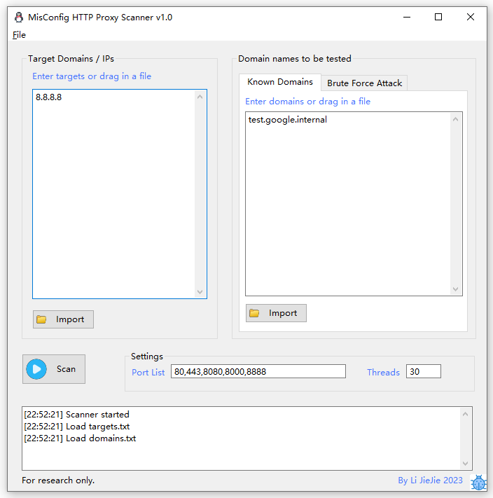
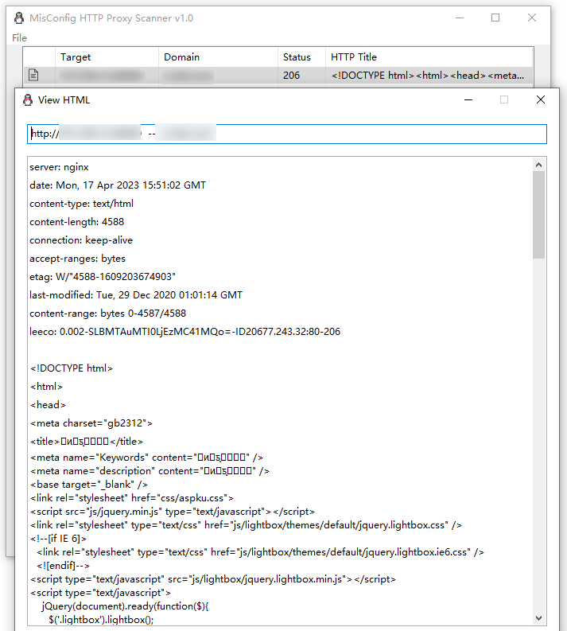

# MisConfig HTTP Proxy Scanner

The scanner helps to:

1) Scan misconfigured reverse proxy servers, to find those web services designed Intra-net access only but accidentally exposed to the Internet.
2) Attack known forward proxy servers, brute with generated intra-net domains to find those existed ones, like:
   * *.company.internal
   * \*.company.local
   * \*.company-inc.net

## Install

This app developed and tested with python3.8 only. Create a python3.8 virtual env, and then install with

```
pip3 install -r requirements.txt
```

## ChangeLog

* 2023-04-19: Fix vulnerability report panel sort bug. 

## How To Use

For the left side input box, input some public IPs or domains that you find via brute / crawler / PassiveDNS etc.

For the right side input box, you have two choices:

* Input some domains you already know that are resolved to private IPs  (10.x.x.x  192.168.x.x)
* If the target corp uses private DNS Zone, use the **brute force attack** to find valid private domain names.

## Screenshot



